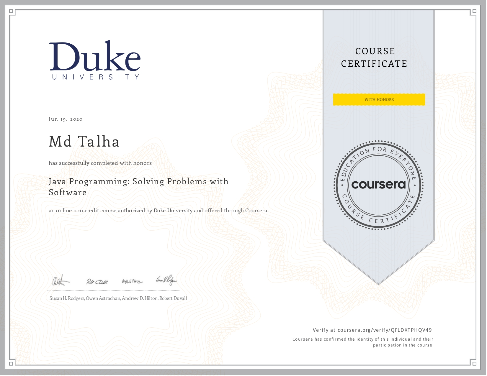
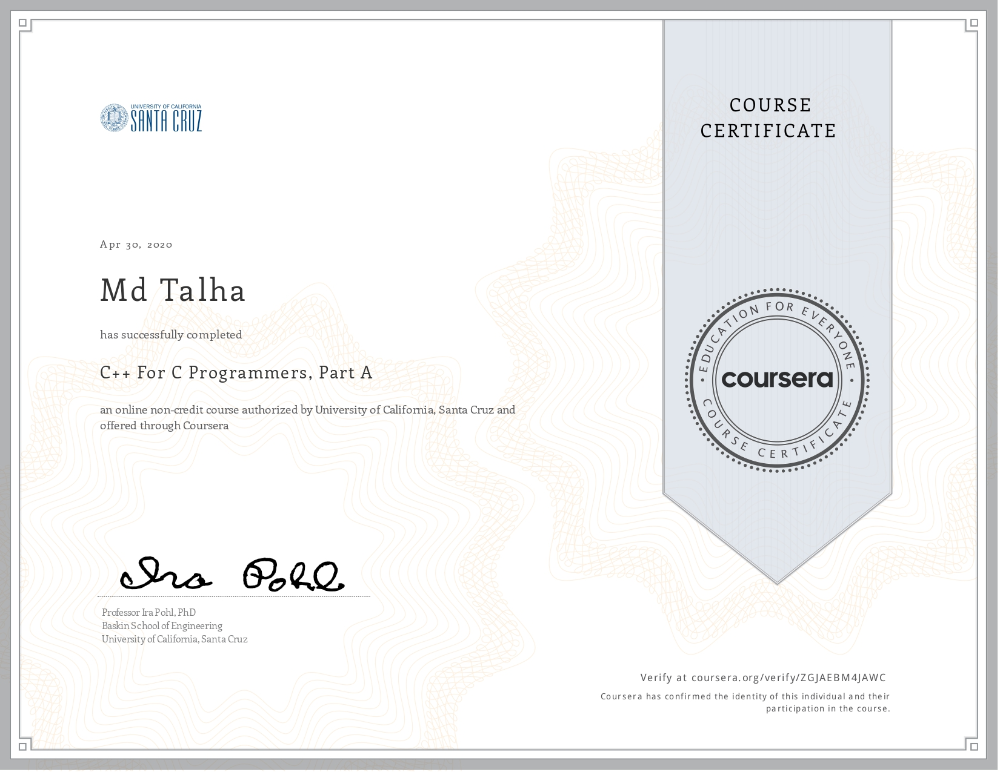
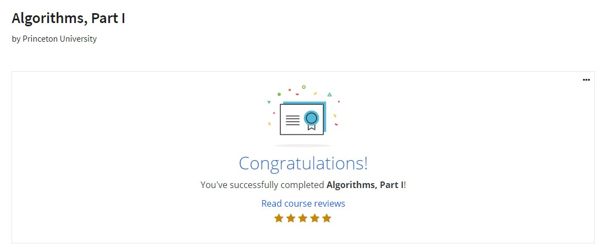
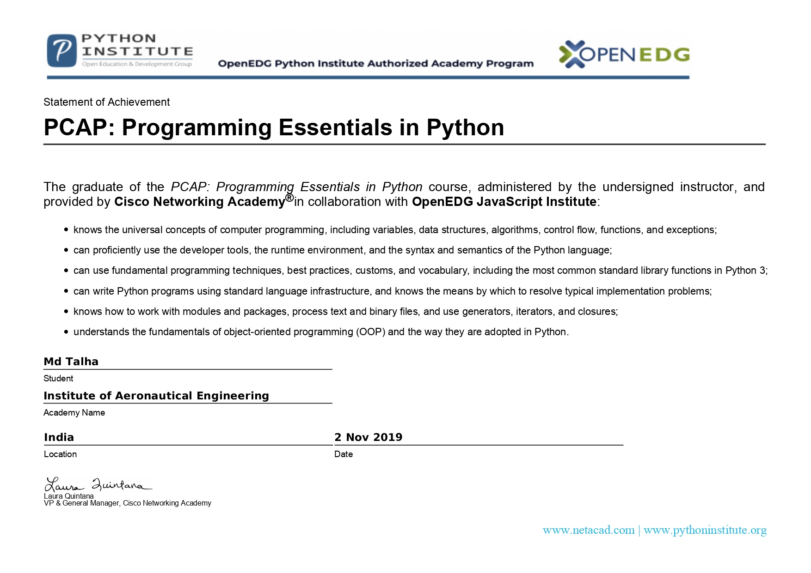

# Certificate

# Coursera

  
Click to expand!

  

    

    <h2>&emsp;1. HTML, CSS, and Javascript for Web Developers</h2>
    

    
  

  

    

    <h2>&emsp;2. Java Programming: Solving Problems with Software</h2>
    

    
  

  

    

    <h2>&emsp;3. C++ For C Programmers, Part A</h2>
    

    
  

  

    

    <h2>&emsp;4. Algorithms, Part I</h2>
    

    
  

# Cisco Networking Academy

  
Click to expand!

  

    

    <h2>&emsp;1. PCAP: Programming Essentials in Python</h2>
    

    
  

